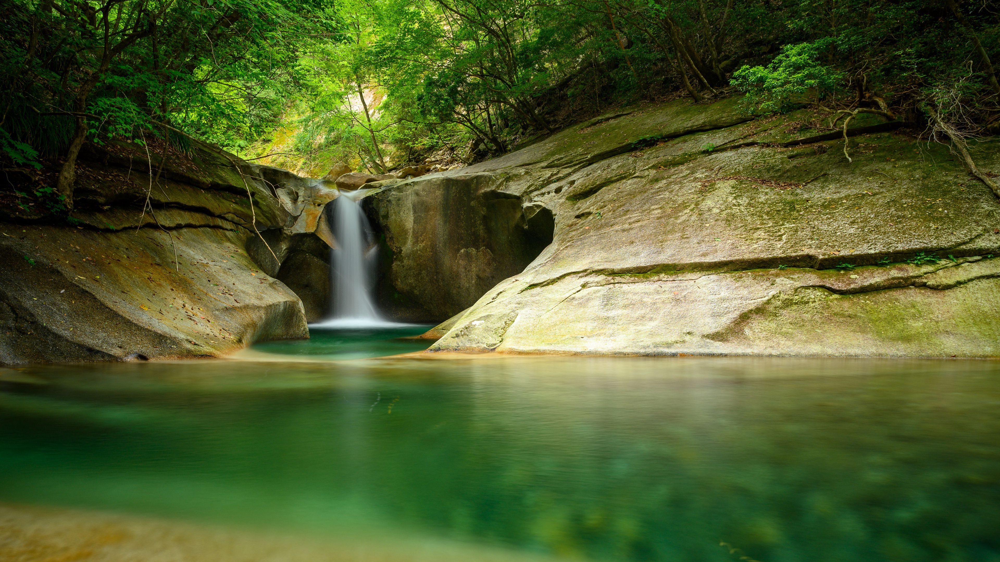

# Виконав: Погоня Андрій Ігорович, Група: ІПЗ-2.03

# Практична №11:

## Завдання:
 1. Ознайомитися з поняттям кольорової гармонії, типами гармоній та колірними моделями
 2. Створити палітри за різними принципами гармонії за допомогою Adobe Color
 3. Згенерувати палітри зображень (Extract Theme) та градієнт (Extract Gradient)
 4. Перевірити контрастність кольорових пар відповідно до стандартів доступності (WCAG)
 5. Висновок

## 1. Ознайомитися з поняттям кольорової гармонії, типами гармоній та колірними моделями

- Кольорова гармонія — це поєднання кольорів, яке приємне для людського ока та створює візуально збалансований і естетично привабливий образ.
  - Навіщо потрібна:
    - Підвищує читабельність та юзабіліті інтерфейсів;
    - Формує емоційне сприйняття контенту;
    - Допомагає створити візуальну ієрархію;
    - Впливає на брендинг та впізнаваність;
    - Забезпечує консистентність стилю в дизайні.

### Типи кольорової гармонії:

- Analogous (Аналогічна)

   - Використовує 3–5 кольорів, які розташовані поряд на колірному колі.

   - Виглядає природно і гармонійно.

   - Приклад: синій, блакитний, зелено-блакитний.

- Monochromatic (Монохроматична)

   - Варіації одного кольору з різними відтінками (світліше/темніше).

   - Створює стриманий, але елегантний вигляд.

   - Приклад: темно-синій, синій, світло-синій.
 
- Triad (Тріада)

   - Три кольори, розташовані на однаковій відстані на колірному колі.

   - Динамічне, але збалансоване поєднання.

   - Приклад: червоний, синій, жовтий.

-  Complementary (Комплементарна)

   - Протилежні кольори на колі (наприклад, синій і помаранчевий).

   - Сильний контраст, ідеально для акцентів.

   - Потрібно обережно, щоб не було "різко".

-  Split Complementary (Розділена комплементарна)

   - Один основний колір + два сусідні до його комплементарного.

   - Менш контрастна, але все ще жива гармонія.

-  Square (Квадратна)

   - Чотири кольори, рівновіддалені на колі (утворюють квадрат).

   - Баланс між теплими і холодними відтінками.

   - Підходить для складніших дизайнів.

-  Custom (Власна побудова)

   - Індивідуально підібрана палітра з урахуванням цілей дизайну, стилю бренду, настрою тощо.

### Колірні моделі: RGB, HSB, LAB

| Модель  | Повна назва                                      | Сфера застосування        | Особливості                                                                        |
| ------- | ------------------------------------------------ | ------------------------- | ---------------------------------------------------------------------------------- |
| **RGB** | Red, Green, Blue                                 | Цифрові екрани            | Додає кольори світла; використовується в веб-дизайні, UI, відео                    |
| **HSB** | Hue, Saturation, Brightness                      | Інтуїтивна для дизайнерів | Hue — відтінок, Saturation — насиченість, Brightness — яскравість                  |
| **LAB** | Lightness, A (зелено-червоний), B (синьо-жовтий) | Друк, точна корекція      | Модель, близька до людського сприйняття кольору. Колірна незалежність від пристрою |

## 2. Створити палітри за різними принципами гармонії за допомогою Adobe Color

### Палітра Analogous:

  - Базовий колір: #F27C41

  - Принцип: Кольори, що розташовані поруч на колірному колесі.

  - Ефект: М'який перехід, гармонійне відчуття — підходить для спокійних, природних дизайнів.

### Палітра Monochromatic:

   - Базовий колір: #F27C41

   - Принцип: Варіації одного кольору — зміна насиченості та яскравості.

   - Ефект: Стильний, стриманий вигляд. Підходить для елегантного інтерфейсу.

### Палітра Triad:

   - Базовий колір: #F27C41

   - Принцип: Три рівновіддалені кольори на колесі.

   - Ефект: Баланс між контрастом і гармонією. Виглядає живо та цікаво.

### Палітра Complementary:

   - Базовий колір: #F27C41

   - Принцип: Протилежні кольори.

   - Ефект: Високий контраст. Добре привертає увагу (наприклад, у кнопках).

### Палітра Split Complementary:

   - Базовий колір: #F27C41

   - Принцип: Один колір і два сусідні до його протилежного.

   - Ефект: Менший контраст, ніж у complementary, але все ще динамічний.

### Палітра Square:

   - Базовий колір: #F27C41

   - Принцип: Чотири кольори на рівній відстані.

   - Ефект: Контрастна, але збалансована схема — підходить для яскравих дизайнів.

### Палітра Custom:

   - Базовий колір: Користувацький набір ( #1E88E5, #42A5F5, #F5F5F5, #212121, #FFC107, #E53935)

   - Принцип: Спеціально підібрані кольори під певний стиль.

   - Ефект: Візуально унікальний, може бути підібраний під бренд чи тему. 
   
## 3. Згенерувати палітри зображень (Extract Theme) та градієнт (Extract Gradient)

### Зображення яке було завантажено в розділи Extract Theme та Extract Gradient:

### Розділ Extract Theme:

#### Colorful

  - Палітра: насичені зелені, оливкові, природні тони.

  - Підходить для: Дизайну з акцентом на природу, енергію, свіжість.

#### Muted

  - Палітра: м’які, менш контрастні кольори.

  - Підходить для: Інтерфейсів, які не мають відволікати. Гарна основа для фону або оформлення додатків.

### Розділ Extract Gradient:

  - Використано те ж зображення що і в Extract Theme.

  - Створено градієнт з трьох точок: дуже темний оливково-чорний, майже чорний з теплим відтінком → світлий кремовий/бежевий - нейтральний і теплий → оливково-зелений, насичений та природний відтінок.

  - Застосування: фон сайту, панелі або графічні переходи у UI.

## 4. Перевірити контрастність кольорових пар відповідно до стандартів доступності (WCAG)

### AA до корекції та після корекції:

- AA до корекції:

  - Контраст: 1.37:1 — недостатній

  - Не проходить WCAG.

- AA після корекції:
  - Контраст: 4.84:1 — підходить

  - Виправлено для звичайного тексту.

### AAА до корекції та після корекції:

- AAА до корекції:
  - Контраст: 1.01:1 — недостатній

  - Не проходить WCAG.

- AAА після корекції:
  - Контраст: 7.35:1 — відповідає високому рівню доступності.

  - Виправлено для звичайного тексту.

## 5. Висновок

### 1. Monochromatic (Монохромна палітра)
🔹 **Найкращий вибір для інтерфейсів.**
- Створює **єдину кольорову атмосферу** з варіаціями одного кольору.
- Легко контролювати **контрастність і читабельність**.
- Підходить для **стриманих, професійних дизайнів**, наприклад, у корпоративних сайтах або інформаційних панелях.

### 2. Analogous (Аналогова палітра)
🔸 Дає **м’який, природний вигляд**, ідеально підходить для сайтів про природу, здоров’я чи медитацію.
- Гармонійна, але іноді бракує контрасту.
- Рекомендується використовувати з **контрастними акцентами**.

### 3. Complementary (Комплементарна палітра)
🟥 Дає **максимальний контраст**.
- Ефективна для **виділення елементів**: кнопок, повідомлень.
- Не підходить для фону та основного інтерфейсу — може **перевантажувати зір**.

### 4. Split Complementary (Розщеплена комплементарна палітра)
🟠 **Менш агресивна версія комплементарної**, зберігає контраст, але виглядає більш збалансовано.
- Ідеальна для **емоційних, але стабільних інтерфейсів**.

### 5. Triad (Тріадна палітра)
🟦 Три кольори з рівною відстанню на колесі.
- Добре **поєднує динаміку та баланс**.
- Може виглядати креативно та молодіжно — підходить для **освітніх або мультимедійних проєктів**.

### 6. Square (Квадратна палітра)
🟩 Дуже насичена палітра з чотирьох кольорів.
- Підходить для **дитячих сайтів, ігор, брендів із яскравим стилем**.
- Вимагає чіткого розмежування кольорових зон, щоб не створювати хаосу.

### 7. Custom (Користувацька палітра)
✨ Формується вручну відповідно до потреб бренду або теми.
- **Найкращий варіант для персоналізованих UI/UX-дизайнів**.
- Важливо перевіряти контрастність і відповідність стандартам доступності.

### 🖼️ Extract Theme (Палітра з зображення)
- **Colorful (яскрава палітра)** — більше підходить для **рекламних матеріалів, сайтів про емоції, творчість**, але не завжди має достатній контраст.
- **Muted (приглушена палітра)** — ідеально підходить для **інтерфейсів**: менше навантаження на очі, **краща читаємість і зручність**.

✅ Для інтерфейсів найкраще підходить **Muted**, бо вона більш стримана і не заважає сприйняттю інформації.

### 🌈 Extract Gradient (Градієнти з зображення)
- Градієнт із 3-х точок (Gradient Stops = 3) дозволяє:
  - Створити **глибину фону**, яка не відволікає від контенту.
  - Використовувати природні переходи кольору з реального фото.
  - Допомагає підтримувати **візуальну цілісність** інтерфейсу, якщо фонове зображення надто активне.

🎯 **Рекомендовано для фонових блоків, header'ів або банерів**, коли потрібен м’який кольоровий перехід.

### ♿ Accessibility Tools (Контрастність)
- Важливо перевіряти комбінації кольорів (фон + текст) за стандартами **WCAG 2.1**:
  - **AA** — для звичайного тексту (контраст ≥ 4.5:1)
  - **AAA** — для великого тексту (контраст ≥ 7:1)
- Багато привабливих кольорових комбінацій не проходять перевірку контрастності.
- Adobe Color пропонує **альтернативи кольорам автоматично** для досягнення відповідності стандартам.

🔐 **Контрастність — критичний фактор для доступності**. Навіть найгарніша палітра не годиться для UI, якщо текст важко читати.

## 📌 Загальний висновок

Для створення **зручного, доступного та привабливого інтерфейсу**:
- Використовуйте **Monochromatic, Analogous або Triad** палітри — вони найзбалансованіші.
- Уникайте занадто насичених схем (Square, Complementary) без перевірки контрасту.
- **Зображення можна ефективно використовувати як джерело палітр і градієнтів**, якщо вибирати стримані варіанти.
- Завжди перевіряти **доступність за WCAG** — особливо важливо для користувачів із вадами зору.

# Посилання на репозиторій та фігму студента:

### Посилання на GitHab репозиторій UI-UX : [GitHab](https://github.com/Herder1836/UI-UX/tree/main)
### Посилання на Figma студента: [Figma](https://www.figma.com/design/BHFXGmvFSGDLrBP2K8oUHb/Workshop_11?node-id=0-1&p=f&t=GrF10UG5ujiHU8gY-0)
